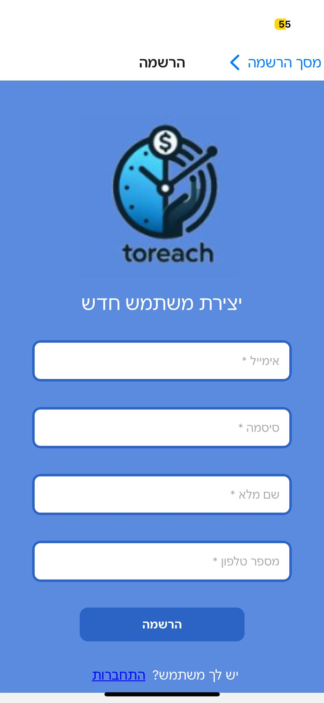

  
  <h1>Embrace the future of scheduling with ToReach 📝🔍</h1>
  
Where simplicity meets efficiency 🌍

---

## Table of Contents

- [Introduction](#-introduction)
- [System Overview](#-system-overview)
- [System Architecture](#system-architecture)
  - [Architectural Design](#-architectural-design)
- [Key Features](#-key-features)
  - [Cross Platform Compatibility](#cross-platform-compatibility)
  - [Business Authorization ](#business-authorization )
  - [Customer Authorization](#customer-authorization)
  - [Business Search and Filter](#business-search-and-filter)
  - [Appointment Booking](#appointment-booking)
  - [Business Calendar](#business-calendar)
  - [Business Rating by Customers](#business-rating-by-customers)
  - [Data Security](#data-security)
  - [Sidebar Navigation (Navbar)](#sidebar-navigation-navbar)
  - [Sales Statistics](#sales-statistics)

- [Human Interface Design](#human-interface-design)
- [License](#-license)

---

## 📑 Introduction

In today's dynamic environment, managing appointments efficiently is a crucial challenge for entities across various sectors. ToReach is born out of the vision to simplify appointment scheduling and management, leveraging cutting-edge technology to bridge the communication gap between businesses and their clients. This React Native application is designed to cater to the evolving needs of digital-native users, offering flexibility, real-time updates, and a seamless user experience.🌍

---

## 📋 System Overview

ToReach is not just an app   it's a comprehensive solution that transforms the appointment management process. It serves as a centralized platform where businesses can schedule, update, and cancel appointments effortlessly, while clients enjoy the convenience of managing their bookings with just a few taps. 🌟

---

## System Architecture

### 📱 Architectural Design
 

### Frontend Architecture
The frontend of ToReach is built on React Native, providing a cross-platform app experience that is both responsive and intuitive. The design emphasizes user-friendly navigation and a clean aesthetic to ensure that users can manage their appointments with ease and efficiency

### Backend Integration

ToReach's backend is powered by Firestore, a flexible, scalable database from Firebase that provides real-time data syncing across user devices. This integration ensures that appointment data is always up-to-date, supporting instant notifications and changes.

## 🌟 Key Features

### Cross Platform Compatibility
- *Universal Access:* Built with React Native for compatibility across both iOS and Android platforms, providing a consistent experience for all users.

### Business Authorization 
- *Secure Access for Business Owners:* Provide a secure sign-up and login mechanism for business owners to manage their profiles and appointments.

### Customer Authorization
- *Seamless Customer Access:* Facilitate customer sign-up and login, ensuring easy access to appointment booking and business exploration.

### Business Search and Filter
- *Discover Businesses Easily:* Implement searching and filtering capabilities for customers to find businesses according to their needs and preferences.

### Appointment Booking 
- *Simplified Booking Process:* Allow customers to book appointments with ease, featuring a user-friendly interface for selecting services and times.

### Business Calendar
- *Manage Appointments Efficiently:* Calendar functionality for business owners to view, manage, and organize appointments effectively.

### Business Rating by Customers
- *Feedback and Improvement:* A rating system for businesses based on customer feedback, promoting quality service and continuous improvement.

### Data Security
- *Protection of Information:* Ensure the secure storage and handling of information provided by both customers and businesses.

### Sidebar Navigation (Navbar)
- *Effortless Navigation:* Provide a sidebar navigation system for, enhancing the user experience by offering easy access to various sections of the app.

### Sales Statistics
- *Insightful Business Analytics:* Offer statistical insights into sales and customer engagement for business owners, aiding in strategic decision-making.

  ---

## Human Interface Design

Our UI is a canvas of user-centric design, harmoniously merging aesthetics and functionality to craft an unparalleled experience.

Key screens include:

| Login | Register Client | Register Business |
| :---: | :---: | :---: |
|  |  |  |

| Client Home Screen | Business Calendar | Busuness tatistics |
| :---: | :---: | :---: |
|    |  |  |

| Client Profile | Business Profile | Business View |
| :---: | :---: | :---: |
||  |  |

| Book Appointment | Search | Navigation |
| :---: | :---: | :---: |
|  |  |  |

For a comprehensive tour of each module's symphony, meticulously composed to serenade for your next appointment,

please navigate to the [Key Features](#-key-features) section above. 🎨📱

---

## 📜 License

This project is licensed under the [Creative Commons Attribution-NonCommercial 4.0 International License (CC BY-NC 4.0)](https://creativecommons.org/licenses/by-nc/4.0/). This means that you are free to share, adapt, and build upon the material, as long as you provide appropriate attribution, do not use the material for commercial purposes, and do not impose additional legal restrictions.

Please note that this license is designed to prevent commercial usage of the code. If you have any questions about how you can use or adapt this code within the terms of the license, feel free to contact us via email ToReach@gmail.com 📮.

## 📬 Contact

If you have any questions, suggestions, or feedback, please don't hesitate to contact us:

ToReach@gmail.com 📮.
